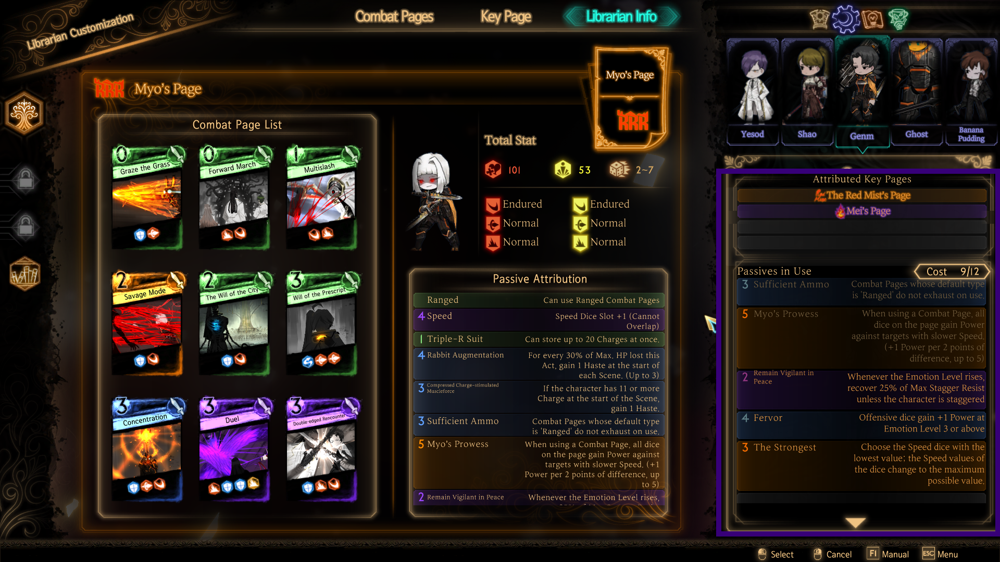
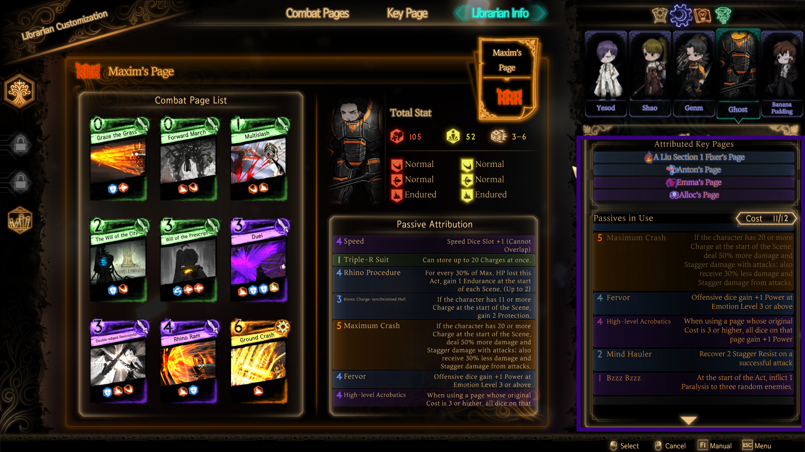
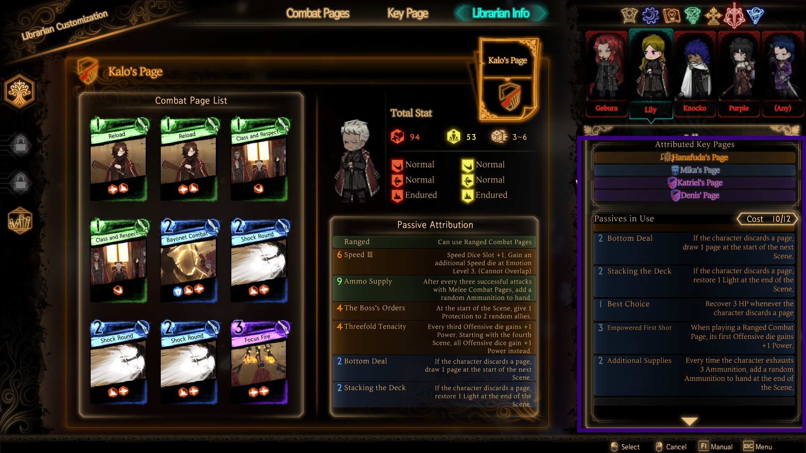
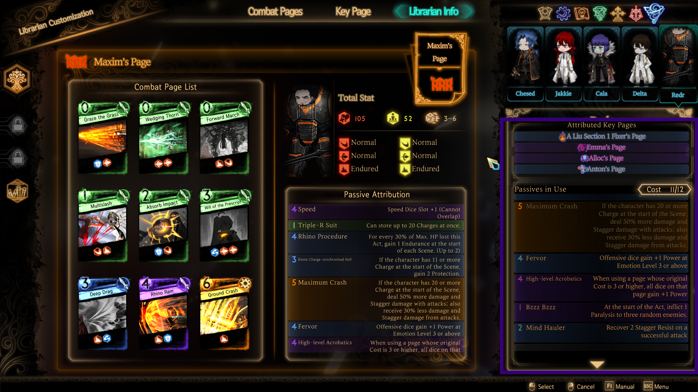
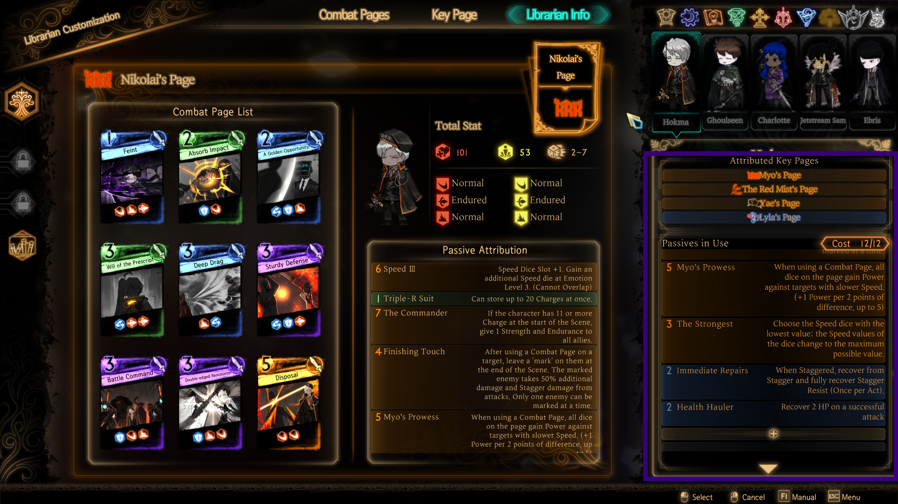

+++
title = "Reverberation Ensemble Guide (and beyond) [SPOILER-FREE]"
description = "This guide is for people who don’t want to build 45 decks for the Reverberation Ensemble, but still want to figure out the gameplay themselves."
date = 2024-08-17
updated = 2024-08-17
draft = false

[taxonomies]
tags = ["Library of Ruina Guides", "lor"]

[extra]
toc = true
series = "Library of Ruina Guides"
+++

# Introduction

**Just decks.** No gameplay tips. No explaining enemy gimmicks. Nothing. You take these decks and *go*. Good luck.

For those who just want deckbuilds and want to figure out gameplay themselves, this SPOILER-**FREE** guide provides various generic, easy-to-pilot, and community-tested decks. If you're wanting to smash the postgame as hard as possible, check the [spoiler-**FULL** guide](/articles/ensemble-spoiler-full), which contains additional gameplay tips and tricks to make the most out of every fight.

Note: this guide assumes you completed every reception and have multiple copies of every combat page and key page.

# Malkuth

* Xiao
  * Frontal Assault, Graze the Grass, Wedging Thorn, Multislash, Gale Kick, Will of the Prescript, Emotional Turbulence, Sturdy Defense, Raging Storm: Love  
  * Volatile Passion, Flaring Brand, Mind Hauler, Hugging Fire Sitting on Brushwood  
* Lowell
  * Frontal Assault, Graze the Grass, Wedging Thorn, Multislash, Gale Kick, Will of the Prescript, Emotional Turbulence, Sturdy Defense, Forming Storm  
  * Locked Potential, Firm as a Great Mountain, Hugging Fire Sitting on Brushwood, Electric Shock
* Miris
  * Frontal Assault, Graze the Grass, Wedging Thorn, Multislash, Gale Kick, Will of the Prescript, Emotional Turbulence, Sturdy Defense, Fiery Dragon Fist  
  * Four Trigrams, Furious Fire Rendering the Skies, Firm as a Great Mountain, Electric Shock  
* Mei
  * Frontal Assault, Graze the Grass, Wedging Thorn, Multislash, Gale Kick, Will of the Prescript, Emotional Turbulence, Sturdy Defense, Tieshankao  
  * Four Trigrams, Locked Potential, Easygoing Breather  
* Cecil
  * Frontal Assault, Graze the Grass, Wedging Thorn, Multislash, Gale Kick, Will of the Prescript, Emotional Turbulence, Sturdy Defense, Tieshankao  
  * Four Trigrams, Furious Fire Rendering the Skies, Wedge

    

# Yesod

* Olivier
  * Graze the Grass, Wedging Thorn, Forward March, Multislash, Steel Knuckles, Will of the Prescript, Duel, Double-edged Rencounter, True Trigram Formation
  * High-Level Acrobatics, Lion’s Fist, Health Hauler, Mind Hauler  
* Yae
  * Graze the Grass, Wedging Thorn, Forward March, Multislash, Steel Knuckles, Will of the Prescript, Duel, Double-edged Rencounter, Exhale Smoke
  * Eyes of Death/Enervation, Fervor, Health Hauler  
* Myo
  * Energy Cycle, Graze the Grass, Multislash, Savage Mode, Will of the City, Will of the Prescript, Concentration, Duel, Double-edged Rencounter  
  * The Strongest, Fervor, Remain Vigilant in Peace  
* Maxim
  * Energy Cycle, Graze the Grass, Multislash, Will of the City, Will of the Prescript, Duel, Double-edged Rencounter, Rhino Ram, Ground Crash  
  * Fervor, High-Level Acrobatics, Mind Hauler, Bzzz Bzzz  
* Dong-hwan
  * Graze the Grass, Wedging Thorn, Forward March, Multislash, Steel Knuckles, Forceful Gesture, Will of the Prescript, Duel, Double-edged Rencounter  
  * High-Level Acrobatics, Lion’s Fist, Mind Hauler, Health Hauler

    

# Hod

  * Purple Tear (pierce stance)
    * Frontal Assault, Graze the Grass, Wedging Thorn, Extract Fuel, Shoving Stab, Gale Kick, Will of the Prescript, Laceration, Prod the Weakness
    * Stiletto, Wedge, Keeping in Stride
  * Allen
    * Frontal Assault, Graze the Grass, Wedging Thorn, Extract Fuel, Shoving Stab, Gale Kick, Will of the Prescript, Laceration, Prod the Weakness
    * Wedge, Piercer, Fervor, Deep Wound, Electric Shock
  * Night Awl  
    * Frontal Assault, Graze the Grass, Wedging Thorn, Extract Fuel, Shoving Stab, Gale Kick, Will of the Prescript, Laceration, Prod the Weakness
    * Wedge, Piercer, Fervor, Deep Wound, Electric Shock
  * Night Awl  
    * Frontal Assault, Graze the Grass, Wedging Thorn, Extract Fuel, Shoving Stab, Gale Kick, Will of the Prescript, Laceration, Prod the Weakness
    * Wedge, Piercer, Fervor, Deep Wound, Electric Shock
  * Bamboo-Hatted Kim:  
    * x3 Draw of the Sword x3 Clone x3 Burning Flash
    * Battle Ready, Dark Cloud Blade, Bottom Deal

    

# Netzach

* Mirinae:
  * x3 Ominous Power, x3 Brace Up, x3 Augury Kick  
  * Bottom Deal, Best Choice, Fervor, Mind Hauler  
* Yan:  
  * Frontal Assault, Wedging Thorn, Forward March, Multislash, Will of the City, Will of the Prescript, Emotional Turbulence, Baleful Brand, Distorted Blade  
  * Fervor, Health Hauler, Mind Hauler, Electric Shock  
* Nikolai:  
  * Graze the Grass, Wedging Thorn, Forward March, Multislash, Absorb Impact, Will of the Prescript, Sturdy Defense, Concentration, Disposal  
  * Battle Ready, Dark Cloud Blade, Fervor, Mind Hauler  
* Esther  
  * Frontal Assault, Wedging Thorn, Forward March, Multislash, Shoving Stab, Somber Procuration, Will of the Prescript, Emotional Turbulence, Castigation  
  * Fervor, Remain Vigilant in Peace, Wedge, Jolting Puncture, Electric Shock  
* Kalo  
  * x2 Reload, x2 Class and Respect, x1 Bayonet Combat, x3 Shock Round, x1 Focus Fire  
  * Bottom Deal, Stacking the Deck, Best Choice, Empowered First Shock, Additional Supplies

    

# Tiphereth
 
* Harold:  
  * Puppet Blockade, Graze the Grass, Extract Fuel, Multislash, A Golden Opportunity\!, Ready Up\!, Will of the Prescript, Sturdy Defense, Duel  
  * Grit, Haboob, Toughness, Keeping in Stride
* Allen 
  * Frontal Assault, Graze the Grass, Wedging Thorn, Multislash, Shoving Stab, Somber Procuration, Will of the Prescript, Laceration, Celestial Spear  
  * Wedge, Fervor, Singular Strike, Keeping in Stride
* Night Awl 
  * Frontal Assault, Graze the Grass, Wedging Thorn, Multislash, Shoving Stab, Somber Procuration, Will of the Prescript, Laceration, Celestial Spear  
  * Wedge, Fervor, Singular Strike, Keeping in Stride
* Night Awl 
  * Frontal Assault, Graze the Grass, Wedging Thorn, Multislash, Shoving Stab, Somber Procuration, Will of the Prescript, Laceration, Celestial Spear  
  * Wedge, Fervor, Singular Strike, Keeping in Stride
* Night Awl 
  * Frontal Assault, Graze the Grass, Wedging Thorn, Multislash, Shoving Stab, Somber Procuration, Will of the Prescript, Laceration, Celestial Spear  
  * Wedge, Fervor, Singular Strike, Keeping in Stride

    

# Gebura

* Red Mist:  
  * x2 Steel Knuckles, x3 Spear, x3 Upstanding Slash, 1x Focus Spirit  
  * Myo’s Prowess, Fervor, Health Hauler, Electric Shock  
* Kalo  
  * x2 Reload, x2 Class and Respect, x1 Bayonet Combat, x3 Shock Round, x1 Focus Fire  
  * Bottom Deal, Stacking the Deck, Best Choice, Empowered First Shot, Additional Supplies
* Esther  
  * Frontal Assault, Wedging Thorn, Forward March, Multislash, Will of the Prescript, Deep Drag, Sturdy Defense, Double Edged Rencounter, Castigation  
  * Fervor, A Fighter that Never Retreats, Health Hauler, Mind Hauler, Electric Shock  
* Yae  
  * Frontal Assault, Wedging Thorn, Forward March, Multislash, Will of the Prescript, Deep Drag, Loss of Senses, Double Edged Rencounter, Exhale Smoke  
  * Sooty Thwack, Locked Potential, Easygoing Breather  
* Purple Tear:  
  * Frontal Assault, Graze the Grass, Wedging Thorn, Multislash, Shoving Stab, Somber Procuration, Venomous Fangs, Will of the Prescript, Laceration
  * Stiletto, Wedge, Electric Shock

    

# Chesed

* Nikolai:  
  * Graze the Grass, Wedging Thorn, Energy Conversion, Multislash, Absorb Impact, A Golden Opportunity\!, Will of the Prescript, Battle Command, Double-edged Rencounter  
  * Battle Ready, Bionic Charge-synchronized Hull, Fervor, Firm as a Great Mountain  
* Mirinae:  
  * x3 Ominous Power, x3 Brace Up, x3 Augury Kick  
  * Bottom Deal, Best Choice, The Messenger, Mind Hauler  
* Xiao  
  * Wedging Thorn, Forward March, Multislash, Somber Procuration, Will of the City, Will of the Prescript, Deep Drag, Emotional Turbulence, Raging Storm: Love  
  * Volatile Passion, Flaring Brand, Mind Hauler, Health Hauler, Electric Shock  
* Olivier:  
  * Frontal Assault, Wedging Thorn, Forward March, Multislash, Somber Procuration, Will of the Prescript, Emotional Turbulence, Sturdy Defense, True Trigram Formation  
  * Fervor, Locked Potential, Health Hauler, Mind Hauler  
* Maxim  
  * Graze the Grass, Wedging Thorn, Forward March, Multislash, Absorb Impact, Will of the Prescript, Deep Drag, Rhino Ram, Ground Crash  
  * Fervor, High-Level Acrobatics, Mind Hauler, Bzzz Bzzz

    

# Binah

* Binah:
  * Fixed deck
  * In Times Like These\!, Easygoing Breather, Mind Hauler, The Messenger  
* Olivier  
  * Frontal Assault, Wedging Thorn, Forward March, Multislash, Repressed Flesh, Will of the Prescript, Deep Drag, Double-edged Rencounter, True Trigram Formation  
  * Fervor, High-level Acrobatics, Mind Hauler, Electric Shock  
* Mirinae  
  * x3 Ominous Power x3 Brace Up x3 Augury Kick  
  * Bottom Deal, Best Choice, Mind Hauler, Fervor, Firm as a Great Mountain  
* Allen  
  * Frontal Assault, Graze the Grass, Wedging Thorn, Multislash, Somber Procuration, Venomous Fangs, Will of the Prescript, Sturdy Defense, Laceration  
  * Wedge, Fervor, Mind Hauler, Piercer, Electric Shock  
* Kalo  
  * x2 Reload, x2 Class and Respect, x1 Bayonet Combat, x3 Shock Round, x1 Focus Fire  
  * Bottom Deal, Stacking the Deck, Best Choice, Empowered First Shot, Additional Supplies

    

# Hokma

* Nikolai  
  * Graze the Grass, Energy Conversion, Multislash, Absorb Impact, Will of the Prescript, Sturdy Defense, Battle Command, Concentration, Disposal  
  * Myo’s Prowess, The Strongest, Immediate Repairs, Health Hauler  
* Bayard  
  * Frontal Assault, Wedging Thorn, Forward March, Multislash, Feint, Shoving Stab, Steel Knuckles, Will of the Prescript, Double-edged Rencounter  
  * Fervor, a Fighter That Never Retreats, Raging Torrent, Mind Hauler, Health Hauler  
* Purple Tear (Slash stance)  
  * x3 Clone, x3 Will of the City, x3 Rapid Gashes  
  * Battle Ready, Dark Cloud Blade, Offensive Position, Mind Hauler, Electric Shock  
* Xiao  
  * Frontal Assault, Wedging Thorn, Forward March, Multislash, Somber Procuration, Will of the Prescript, Emotional Turbulence, Sturdy Defense, Raging Storm Love  
  * Volatile Passion, Flaring Brand, Keeping in Stride, Mind Hauler, Electric Shock  
* Bamboo-Hatted Kim
  * x3 Draw of the Sword, x3 Clone, x3 Burning Flash  
  * Dark Cloud Blade, Battle Ready, Bottom Deal

    

# Keter
 
* Black Silence:
  * Fixed deck
  * Lone Fixer, Fervor, Mind Hauler, Health Hauler  
* Nikolai  
  * Graze the Grass, Wedging Thorn, Multislash, Will of the City, Will of the Prescript, Battle Command, Concentration, Duel, Disposal  
  * Maximum Crash, Mind Hauler, Health Hauler, A Fighter That Never Retreats  
* Purple Tear (pierce stance)  
  * Frontal Assault, Graze the Grass, Wedging Thorn, Multislash, Dagger Press, Somber Procuration, Will of the Prescript, Sturdy Defense, Laceration 
  * Stiletto, Wedge, Keeping in Stride
* Mirinae  
  * x3 Ominous Power, x3 Brace Up, x3 Augury Kick  
  * Bottom Deal, Best Choice, Mind Hauler, Firm as a Great Mountain, Fervor  
* Olivier  
  * Frontal Assault, Wedging Thorn, Forward March, Multislash, Feint, Will of the Prescript, Deep Drag, Double-Edged Rencounter, True Trigram Formation
  * Fervor, Locked Potential, Mind Hauler, Health Hauler

    

# The Elite Squad

Struggling with a fight and need to concentrate **everything** onto a single floor? Take 5 of your favorite picks from here. With the exception of Red Mist and Binah, these decks work on every floor.

* Nikolai
  * Graze the Grass, Wedging Thorn, Multislash, Will of the City, Will of the Prescript, Battle Command, Concentration, Duel, Disposal  
  * Maximum Crash, Mind Hauler, Health Hauler, A Fighter That Never Retreats
* Purple Tear (pierce stance)  
  * Frontal Assault, Graze the Grass, Wedging Thorn, Multislash, Dagger Press, Somber Procuration, Will of the Prescript, Sturdy Defense, Laceration 
  * Stiletto, Wedge, Keeping in Stride
* Mirinae  
  * x3 Ominous Power, x3 Brace Up, x3 Augury Kick  
  * Bottom Deal, Best Choice, Mind Hauler, Firm as a Great Mountain, Fervor  
* Olivier  
  * Frontal Assault, Wedging Thorn, Forward March, Multislash, Feint, Will of the Prescript, Deep Drag, Double-Edged Rencounter, True Trigram Formation
  * Fervor, Locked Potential, Mind Hauler, Health Hauler
* Xiao  
  * Frontal Assault, Wedging Thorn, Forward March, Multislash, Somber Procuration, Will of the Prescript, Deep Drag, Double-Edged Rencounter, Raging Storm: Love  
  * Mind Hauler, Health Hauler, Volatile Passion, Flaring Brand, Electric Shock  
* Red Mist  
  * x2 Steel Knuckles, x3 Upstanding Slash, x3 Spear, x1 Focus Spirit,   
  * Myo’s Prowess, Offensive Position, Health Hauler, Mind Hauler  
* Binah 
  * Fixed deck 
  * In Times Like These\!, Easygoing Breather, Fervor, Mind Hauler

      

# Credits

Special thanks to the following people who contributed to the making of this guide:

* Aisir  
* Alice Margatroid  
* Atse  
* CountDuckoo  
* Jakkie  
* Mozzarella  
* Render  
* Stuff  
* Loki
