+++
title = "Reverberation Ensemble Guide (and beyond) [SPOILER-FULL]"
description = "This guide is for people who want to smash endgame Library of Ruina as hard as possible."
date = 2024-08-17
updated = 2024-08-25
draft = false

[taxonomies]
tags = ["Library of Ruina Guides", "lor"]

[extra]
toc = true
series = "Library of Ruina Guides"
thumbnail = "banner.png"
+++

# Spoiler-Full Introduction

That means this section is **full of spoilers**. Don't say I didn't warn you. [Go here for the spoiler-FREE guide.](/articles/ensemble-spoiler-full)

Once you enter the Reverberation Ensemble, you will be locked out of burning books, abno suppressions, realizations, and any other reception. Forfeiting at any point of the game from this point onwards will reset your progress, so don't click the button that says "forfeit" (Clicking "return to title" is safe). If, however, you do accidentally click forfeit, *immediately* Alt-F4ing will close the game before it saves, hopefully reverting the game back to before you forfeited.

You **must** do all realizations by this point of the game, or else you will be completely locked out of the True Ending and forced to forfeit.

In the Reverberation Ensemble, each floor gets to fight a member of the, well, Reverberation Ensemble. Individually, each reception can easily wipe the opposing party if you brought the best key pages; to spice things up, Reverb Ensemble implements a *layer lock* mechanic. Once you use a combat page or key page and win, you cannot reuse them until the next layer gets unlocked. The layers are:

* Asiyah: Malkuth, Yesod, Netzach, Hod
* Briah: Tiphereth, Gebura, Chesed
* Atziluth: Binah, Hokma, Keter

So for example, if you fight Malkuth with Xiao with Health Hauler (Lyla), you won't be able to use Xiao, any combat pages she was holding, nor 1 copy of Lyla for Yesod's, Netzach's, or Hod's respective fights. Once you beat Yesod, Netzach, and Hod, *then* you will be able to reuse Xiao for one of the Briah floors.

The following sections will present gameplay tips that will help you exploit the weaknesses of each Ensemble member.

# Malkuth

Reference: [Malkuth, spoiler free builds](/articles/ensemble-spoiler-free/#malkuth)

## Gameplay Tips

Philip is a 3-phase fight, with each phase locked behind a health gate. You can also accelerate the fight by staggering him. His natural resistances are quite high, but his stagger resistances change to fatal by inflicting 15 burn. Thus, the strategy is to quickly stack 15 burn before rushing him down.

* Phase 1: 
  * Clash your 3-costs against the double offensive pages.
  * Try to avoid clashing into the Sturdy Defense sidegrades; if you do, throw econ pages at them.
  * Not really in a rush to get past this phase; focus here is to build hand size \+ team emotion level to prep for the next phase
* Phase 2: 
  * The babies are back, but thankfully don't have their annoying passives.
  * Mass spam, preferably at least once per scene. This is why building emotion is important; you get access to Ego masses and, hopefully, Xiao's also
  * Clash high-rolling single-dice vs the ranged pages. Avoid getting hit by Restrain whenever possible. You can ignore the baby attacks; they don't do much damage.
  * Tips: Green Stem attacking the Vines (abno page) target as its primary target will increase its power
  * Tip: you can reroll mass targeting by deselecting and reselecting. This lets you target all the slotted-in baby speed dice, and therefore destroy most or all of the babies' attacks.
* Phase 3:
  * This phase is similar to phase 1 except Philip has more speed dice. Thankfully, you also have more speed dice due to emotion level.
  * If you haven't killed the babies, they'll carry over to this phase. Generally, this means you didn't mass enough, or didn't do enough damage for them.
  * After stacking to 15 burn yet again, you can hopefully 1-side Philip to death.

### Recommended Abnos \+ Egos

* Abnos:
  * Tier 1: Nostalgic Embrace \> Display of Affection \> Matchlight \> Ashes \> The Fairies' Care \> Happy Memories
  * Tier 2: Gluttony \>\>\> Vines \> Predation \> Spores \> Worker Bee. Do not pick Footfalls
  * Tier 3: Loyalty
* Egos: Green Stem \> FMF \> Wingbeat \> Hornet \> The Forgotten

### Demo

{{ youtube(id="WcDaYmMIGhA") }}

## Optimized Build

Equipped with this knowledge, we can construct a counterbuild specifically tailored to fighting Philip. You shouldn't bring this build to any reception other than this one.

* Build
  * Xiao 
    * Will of the Prescript, Multislash, Frontal Assault, Forward March, Wedging Thorn, Steel Knuckles, Gale Kick, Double Edged Rencounter, Fervid Emotions
    * Lone Fixer, Remembrance, Kizuna/Extreme Fatigue (Shi Fixer), Mind Hauler
  * Assistant librarian
    * x3 Coordinated Assault, x3 Dagger Press, x3 Evade or something
    * Snipe, Blind Fire, Concentration, Bzzz Bzzz
  * Assistant librarian
    * x3 Coordinated Assault, x3 Dagger Press, x3 Evade or something
    * Snipe, Blind Fire, Concentration, Bzzz Bzzz
  * (do not bring a 4th or 5th nugget)

  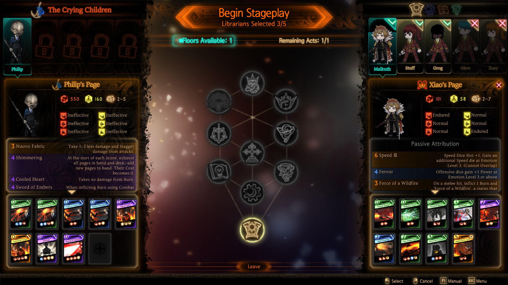

Abnos \+ Egos same as previous section.

* PHASE 1:
  * Opening: Turn 1
    * Mooks clash Coordinated Assault. Xiao clashes card draw if able.
    * You want to get to team emo level 1 at the end of the turn.
    * On Xiao, pick
  * Opening: turns 2-3
    * Let both your mooks die
    * On turn 2, do nothing as Xiao. You'll hit emo level 2 anyways due to ally death
    * On turn 3, clash or 1-side a *little* bit as Xiao in order to hit emo level 3
* PHASE 2:
  * Mass, then mass again. Prefer Green Stem \> Tao Tie \> FMF. Clash Steel Knuckles \+ Gale Kick vs ranged page
* PHASE 3: Dogpile on the slowest die

### Demo 2

{{ youtube(id="YjCfuAYLwec") }}

# Yesod

Reference: [Yesod, spoiler free builds](/articles/ensemble-spoiler-free/#yesod)

Eileen is also a 3-phase fight, with each phase locked behind a health gate. However, all three phases are pretty much the same. Killing a churchgear will cause her to take a huge amount of stagger damage and then use a mass. This seems threatening, but she also stops making all other attacks. Thus, forcing Eileen to mass is actually preferred over trying to avoid the mass attacks, and so the strategy is to frequently kill churchgears.

## Gameplay Tips

* With the exception of Vapour, your dice generally outrolls theirs
* With Vapour, mitigate with a leading block
* With the rest, you can (mostly) ignore. Try to "index" each Churchgear one by one (that means focus fire one dead at a time).
* The mass is a 2-die mass sum (not individual). The interactions are a bit strange, but all you need to know is that only the bigger die matters. If you bring mass busters (cards with high summed rolls) these should not be an issue.
  * Example mass busters: Sturdy Defense, Duel, Double-Edged Re-Encounter
  * If you're in a pinch, Ego pages such as Harmony and Regret can serve as an emergency mass buster.
* Maintain high econ with x1 3-cost and fill the rest of your speed dice with econ cards. This helps ensure that you will always be ready to counter a mass attack
* Optionally attribute Puffy Brume to mitigate damage from Smoke
* Myo's Prowess respects dice targeting even when 1-siding and using mass attacks. Myo's Prowess does *not* respect dice targeting when defending against a mass.
* Grinder Mk. 5-2 pretty much nullifies every churchgear for a turn. It's very strong in this reception
* Due to healthgates, single-target Ego such as Lament, Harmony, and Regret aren't as strong. They, however, can be used to finish off Eileen once she hits her 100 HP healthgate. Keep in mind that this doesn't clear out surviving churchgears
* Once Eileen is staggered, it is easy to reach the next healthgate. Use this time to restore your nuggets' economy (card draw and light restore)

### Recommended Abnos \+ Egos

* Abnos:
  * Tier 1: Metallic Ringing \= Repetitive Pattern Recognition \= Request \> Lament \> Violence \= Rhythm
  * Tier 2: Chained Wrath \= Clean (on Myongest user) \> Recharge \> Eternal Rest (bugged) \> Musical Addiction (screws over your mass busters) \= Seventh Bullet (can screw you over in general randomly)
  * Tier 3: Dark Flame if confident, Music or Coffin if not
* Egos: Grinder Mk. 5-2 \> Magic Bullet \> all others

### Demo

{{ youtube(id="9kzyZECkwFQ") }}

## Optimized Build

The builds outlined in [Yesod, spoiler free](/articles/ensemble-spoiler-free/#yesod) are sufficient. Your gameplay and Ego page usage determine the fight.

You're free to make additional tweaks as you see fit.

# Hod

Reference: [Hod, spoiler free](/articles/ensemble-spoiler-free/#hod)

Greta also has 3 phases, with each phase locked behind a health gate, and with all three phases that are pretty much the same. Due to her strong resistances, anti-stagger, and innate 3 protection, the general strategy is to kill her through indirect damage (namely bleed).

Her "Sharkskin" passive will resist your attempts to status her: she will ignore the first 20 status inflictions with her 20 stacks of Resilience. However, with the right build, you can brute force your way through 20 inflictions within 2 turns. Every 5 turns, she will refresh with 10 stacks of Resilience. At that point, you can brute force your way through in half a turn.

Upon entering the fight, she has three meat sacks with her. These don't do anything. You can ignore them.

Starting in her second phase, she will begin using the combat page "Into the Sack\!", which will "sack" the librarian and put them in a sack. In the next scene, she will then attack that sack. Unlike in the first phase, this sack actually does do something:  if Greta successfully lands the killing blow, your librarian is **instantly killed**. If, however, you land the staggering blow (and, thankfully, your attacks only do stagger damage), then your librarian is **freed, healed to full stagger, and healed up to the sack's remaining HP**. Therefore, with smart sacking you can navigate this fight heal-free.

When her third phase starts, she **instantly kills** all sacked librarians. The third phase is otherwise identical to the second.

## Gameplay Tips

* Ignore the meats until a librarian gets sacked
* Just brute force your way through Resilience with bleed, burn, paralysis, feeble, disarm, fragile application. You have a lot.
* Each instance of debuff application reduces resilience by one. For example, Mangle with Carver of Scars \+ Deep Wound \+ Digging Shank attributions will delete 10 resilience: 2 from base effect, 2 from Digging Shank, 2 from Carver of Scars, and 2 from Deep Wound. The only effects that don't increase their infliction by adding a new instance of debuff is pierce stance and the Obsession abno page.
* Strategically use Into the Sack\!'s healing to prevent dying. Once your librarian gets sacked, you should prioritize freeing them over damaging Greta.
* Redirect Greta's attacks onto the Into the Sack\! target so that she doesn't use those attacks (because the target gets sacked first).
* If you want to cancel Into the Sack\! for whatever reason, you can destroy the die with a mass attack. She will use it again next turn however.
* Build emotion level to access your abno and Ego pages. Your abno pages provide good power and status infliction; you really want Sanguine Desire
* Use Sanguine Desire, not for the sexy 3rd die roll, but because of the anti-bleed reduction effect. Sanguine Desire can take out 150+ HP in a single turn from measly 10 bleed alone. At 20-30 bleed, Sanguine Desire pretty much guarantees that Greta will hit the next health gate.

### Recommended Abnos \+ Egos

* Abnos:
  * Tier 1: Cocoon \> Look of the Day \> Axe \> others. Put Cocoon on not-Purple Tear
  * Tier 2: Alertness \> Friend \> Shyness \= Obsession \= Meal \> Funny Prank
  * Tier 3: Gooey Waste. The others are bad, so don't pick them.
* Egos: Sanguine Desire \>\>\> others

### Demo

{{ youtube(id="-s1aFqp4aOQ") }}

## Optimized Build

The builds outlined in [Hod, spoiler free](/articles/ensemble-spoiler-free/#hod) are sufficient. You may optionally drop Bamboo Hatted Kim and replace him with another Night Awl. Note that you should still use Sanguine Desire off cooldown whenever possible despite the \-2 Slash die power penalty because the value of the page lies in its effect and not its rolls.

# Netzach

Reference: [Netzach, spoiler free](/articles/ensemble-spoiler-free/#netzach)

Bremen, thankfully, does not have three phases. They have two phases.

In the first phase, they join with four...random...things...? I honestly don't know what the theme is. Occasionally Bremen throws out a buff and/or a debuff that makes you eat dirt for that scene. Upon getting staggered, Bremen recovers from stagger in the next scene. This happens up to three times. Note that Bremen has no health gate.

After staggering Bremen three times, they enter the next phase where they are unstaggerable and throw out various attacks, including an occasional mass. After throwing out the mass, their resistances turn to fatal and they become staggerable for the scene.

The gimmick is that Bremen can "only" be staggered three times total, and Bremen recovers from stagger instantly. Make each stagger count. Beyond that, simply win your clashes.

## Gameplay Tips

* Focus one target at a time. Avoid the temptation to overclash in the start of the match
  * Kill the puppets first, then the churchgear, then Ms. Mermaid
* Try to redirect BAWKBAWKBAWK away from Bremen's ally if possible
* Feel free to ignore the "tagged" mechanic
* Effects that make you deal more damage, such as Smoke and Nikolai's Mark, let you quickly chew through Bremen's 900 HP fast.
  * Fight is still winnable even if you don't burst down Bremen quickly enough, but the fight becomes slow and painful.
* Spring's Genesis is a free win, but it also drags on the fight

### Recommended Abnos \+ Egos

* Abnos:
  * Tier 1: Laughing Powder \> Pebble \> Echoes from Beyond \= Tentacles \= Thorns \= Elation
  * Tier 2: Incomprehensible \= Token of Friendship \> Teardrop \= Flower Petals \= Autumn's Passing \= Ever Repeating Performance
  * Tier 3: Spring's Genesis
* Egos: Any

### Demo

{{ youtube(id="uxyT4nn8LS4") }}

## Optimized Build

Although the builds outlined in the [Netzach, spoiler free](/articles/ensemble-spoiler-free/#netzach) are sufficient, you may decide to throw in Deep Drag on a few nuggets like so, for extra damage:

* Esther
  * Frontal Assault, Wedging Thorn, Forward March, Multislash, Shoving Stab, Somber Procuration, Will of the Prescript, Emotional Turbulence, ~~Castigation~~ → **Deep Drag**
  * Fervor, Remain Vigilant in Peace, Wedge, Jolting Puncture, Electric Shock
* Yan:
  * Frontal Assault, Wedging Thorn, Forward March, Multislash, Will of the City, Will of the Prescript, Emotional Turbulence, Baleful Brand, ~~Distorted Blade~~ → **Deep Drag**
  * Fervor, Health Hauler, Mind Hauler, Electric Shock
* Nikolai:
  * Graze the Grass, Wedging Thorn, Forward March, Multislash, Absorb Impact, Will of the Prescript, Concentration, Disposal, ~~Sturdy Defense~~ → **Deep Drag**
  * Battle Ready, Dark Cloud Blade, Fervor, Mind Hauler

# Tiphereth

Reference: [Tiphereth, spoiler free](/articles/ensemble-spoiler-free/#tiphereth)

Oswald's main gimmick is his possession mechanic. The card We Need You, You Know\~? instantly staggers and takes control of one of your librarians for two scenes.

There are two ways to accomplish this: either give Oswald a nonthreatening librarian and mitigate the damage done, or give Oswald your most threatening librarian and shoot for Wrath and Tiphxodia.

## Gameplay Tips

**Mitigation strategy:**

* Focus Mr. Knife and Ms. Mermaid first
* Ignore your possessed librarian to the best of your ability
* You can use a mass attack to cancel We Need You, You Know\~?. However, like Into the Sack\!, Oswald will use it again in the next scene.

**Tiphxodia strategy**

* Play weak cards on turn 1 to generate enough negative emotion coins for Despair.
* Don't be afraid to let your Tiphxodia target get possessed by Oswald.
* Don't be afraid to let your Tiphxodia target kill your teammates after grabbing Wrath.

### Recommended Abnos \+ Egos: 

**Mitigation strategy**

* Abnos:
  * Tier 1: Love \= Blessing \> Justice \> Hate \= Despair \> Blades Whetted by Teardrops
  * Tier 2: Intemperance \> Road to Happiness \> Greed \= Companion \> Wrath \= Magical Girls
  * Tier 3: Acidic Sludge
* Egos: Sword Sharpened with Tears \> In the Name of Love and Hate \= Gold Rush \> Blind Rage \= Nihil

**Tiphxodia strategy**

* Abnos:
  * Tier 1: Despair, then Hate
  * Tier 2: Greed, then Wrath
  * Tier 3: Nix
* Egos: Blind Rage \> Sword Sharpened with Tears \> In the Name of Love and Hate \= Gold Rush \= Nihil

### Demo

{{ youtube(id="ZBKfsf4mHU4") }}

## Optimized Build

This build plays into Tiphxodia.

* Philip
  * x3 Gale Kick, x3 Jiao Tu, x2 Fiery Dragon Slash, x1 Laceration
  * Lone Fixer, Remembrance, Four Trigrams
* 4 assistant librarians
  * Unequipped

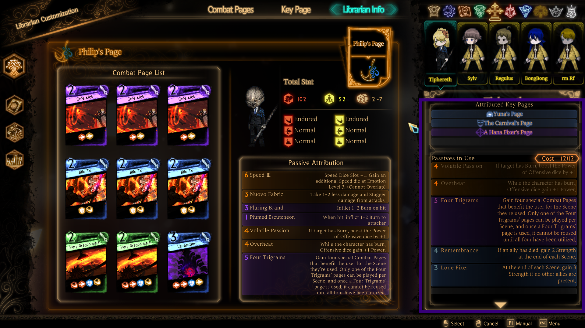

Your opening should look like this:

* Turn 1: do literally nothing, except perhaps to redirect attacks away from Philip (if possible). 1 or 2 librarians should die, which should generate enough negative emotion coins to get Despair
* Turn 2: Redirect We Need You, You Know\~? away from Philip. Target Mr. Knife with Gale Kick. Do nothing otherwise. All librarians except Philip should be dead by the end of turn 2\. You should have enough emotion coins to grab Hate.
* Turn 3: Use Gale Kick and Laceration to target Mr. Knife. Also use the Defense trigram to reduce damage taken. You should be able to deal a lot of damage to Mr. Knife before getting stupefied. Take Greed
* Turn 4: P Spacebar. Take Wrath
* Turn 5: P Spacebar. Take Tiphxodia

The rest of the fight is up to you. Be sure to pick up Blind Rage – that mass is relatively low cost, breaks We Need You, You Know\~?, and deals a lot of damage.

### Demo 2:

{{ youtube(id="GW_lwkf8WBk") }}

# Gebura

Reference: [Gebura, spoiler free](/articles/ensemble-spoiler-free/#gebura)

Tanya's gimmick is that after you kill her once, she gains \+2 strength and endurance for the rest of the fight. She also uses Beatdown on occasion.

This fight is more of a test on how well you can pilot Red Mist than actually playing against any gimmick because there's not much gimmick here to begin with.

## Gameplay Tips

* Prevent Tanya from gaining strength from Intimidate whenever possible.
* As Red Mist, prevent Lupine Onslaught and Fisticuffs from eating your counter dice by actively clashing them with something else. Lupine Onslaught inflicts powernull while Fisticuffs has an anti-recycle effect. I recommend Focus Spirit or Upstanding Slash vs Lupine Onslaught, and Spear or Upstanding Slash vs Fisticuffs
* As the Red Mist, redirect Overspeed using your infinite die if Tanya would meet the speed threshold.
* As the Red Mist, try to avoid getting paralyzed if possible.
* As the Red Mist, you can destroy Beatdown via Great Split: Vertical (clash against a card other than Beatdown) or via Great Split: Horizontal
* Myo's Prowess respects dice targeting even when 1-siding and using mass attacks. Myo's Prowess does *not* respect dice targeting when defending against a mass.
* Avoid Claws of Savagery as in this fight specifically, that librarian will lose the ability to redirect.

### Recommended Abnos \+ Egos

* Abnos:
  * Tier 1: Role of the Wolf \> Vampirism \= Vengeance \= Prey \> Claws of Savagery. Do not pick Fear of Water
  * Tier 2: Absorption \> Instincts \> Ruddled Welts \> Laughter \> Wine \> Mountain of Corpses
  * Tier 3: Shell \> Goodbye \> Hello?
* Egos: Doesn't matter; you're running the Red Mist. But Dipsia \= Smile \= Mimicry \= Cobalt Scar \> Crimson Scar

### Demo

{{ youtube(id="pGVR8BxbPJs") }}

## Optimized Build

The build outlined in [Gebura, spoiler free](/articles/ensemble-spoiler-free/#gebura) is sufficient.

Although you can viably build a dedicated Mountain of Bodies team around solo Gebura, I recommend against doing so in this particular fight. Tanya is frail, and you can reasonably kill her quickly.

# Chesed

Reference: [Chesed, spoiler free](/articles/ensemble-spoiler-free/#chesed)

Jae Heon's puppets are practically unkillable so long as they have the status effect "Puppet Strings." In order to remove this status effect, you need to win clashes against Jae Heon's counter dice over four scenes.

When all four puppets truly die, Jae Heon doesn't do anything particularly special. Without the puppets backing him up, you can easily rush him down.

It's easier to simply prevent Jae Heon from inflicting Puppet Strings in the first place. The strategy is to rush down puppets without Puppet String as fast as possible, then clean up the rest later.

## Gameplay Tips

* Prioritize focussing Puppet Angelica before Jae Heon gets puppet strings. If you manage to kill her fast enough, focus fire on the Weighty Puppet also.
* Puppets, despite being unkillable, are still staggerable. Staggering puppets with Puppet String can give you more time to remove the Puppet String status effect

### Recommended Abnos \+ Egos

* Abnos:
  * Tier 1: Courage \> Timber \= Gleaning \> Torn Off Wisdom \= Rake \= Cardiae
  * Tier 2: Warm Heart \> Road Walked Together \= Emerald \= Power of the Past \= Oblivion \> Home
  * Tier 3: Powder of Life \> False Present \> Magic Trick
* Egos: Logging \> Harvest \= Homing Instinct \= Faded Memories \> False Throne

### Demo

{{ youtube(id="plxXTvgGGfo") }}

## Optimized Build

The builds outlined in [Chesed, spoiler free](/articles/ensemble-spoiler-free/#chesed) are sufficient.

# Binah

Reference: [Binah, spoiler free](/articles/ensemble-spoiler-free/#binah)

Similar to Gebura vs Tanya, this fight is moreso how well you can play Binah over any particular gimmick that Elena or Vermillion Cross can throw out. Unlike the Red Mist fight, however, this one basically boils down to "read the text on Degraded Pillar's first die."

## Gameplay Tips

* Save Degraded Pillar for Rampageous Strike
* Clash Degraded Pillar against Rampageous Strike
* Redirect Circulation away from Vermillion Cross
* Focus fire Vermillion Cross first
* Don't stress out over getting The Beast because it's likely that you kill her before you get to emo 5 anyways.

### Recommended Abnos \+ Egos

* Abnos:
  * Tier 1: Big Eyes \> Weight of Sin \= Eternally Lit Lamp \= Long Arms \> Small Flutters \> Watchful Eyes. Big Eyes is normally tricky to deal with, but due to the relative lack of speed dice, it is easy to redirect away from the Big Eyes holder even without Eternally Lit Lamp
  * Tier 2: Tilted Scales \> Salvation \> Punishment \= Punishing Beak \> Small Beak \> Judgement
  * Tier 3: Beast if managed to get all the eggs, Guardians of the Forest if you spread out your abno pages; Peace otherwise. 
* Egos: Lamp \= Apocalypse \> Justitia \= Beak \= Twilight

Note the following synergies among abno pages, which may situationally move the tier of an abno page up or down depending on the current game state:

* \[same\] Eternally Lit Lamp makes activating Salvation's \+1 power effect trivially easy
* \[diff\] Eternally Lit Lamp can redirect targets away from the Big Eyes holder
* \[same\] Small Flutters tries to make your librarian untouchable for Punishing Beak
* \[diff\] Small Beak makes activating Punishment's effect trivially easy
* \[same\] Small Beak additionally lets you grab Punishing Beak without penalty, as Punishing Beak specifically states taking damage "from attacks"
* \[same\] Tilted Scales patches up the self-damage from Weight of Sin
* \[fake\] Long Arms prevents damage from Judgement's Sin effect...or it's SUPPOSED to, since this is bugged and the Sin effect procs anyways
* \[same\] If you put all your eggs in one basket, you get to activate The Beast

### Demo

{{ youtube(id="mlThByRcjZY") }}

## Optimized Build

The builds outlined in [Binah, spoiler free](/articles/ensemble-spoiler-free/#binah) are sufficient.

Elena and Vermillion Cross are frail enough that you can kill them by team emotion level 3 or 4\. Therefore, I recommend against trying to activate The Beast (unless you want to have fun).

If, for whatever reason, you want to kill Elena even faster than you already do, you can run the following build on Olivier:

* Olivier
  * x3 Opportunity Spotted, x2 Steel Knuckles, x3 Will of the City, x1 True Trigram Formation
  * Health Hauler, Mind Hauler, Grit, Firm as a Great Mountain

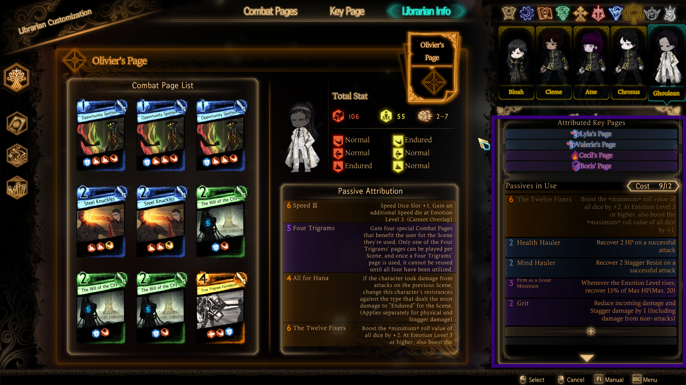

You MUST pick Weight of Sin as your first abno card in order for this deck to succeed. After obtaining Weight of Sin, use Opportunity Spotted to activate Weight of Sin repeatedly. This deck works well with Big Eyes.

### Demo 2:

{{ youtube(id="yT4lWAwXe6o") }}

# Hokma

Reference: [Hokma, spoiler free](/articles/ensemble-spoiler-free/#hokma)

*cracks knuckles* Alright, this one's going to be a doozy.

Pluto is a 2 phase fight with contracts. I'll explain the contract part in a bit.

In the first phase, your non-patron librarians get cloned as "Shades" that you'll fight against. This is a similar but different take of "I'm you but better" compared to Pinocchio: key pages including passive attributions are copied over, and shades either play a card from the nugget's deck or a Shade-exclusive card. During this phase, Pluto is immune\* to damage, so the only way to progress is to kill all the Shades. Then, Pluto will enter the second phase.

In the second phase, Pluto will "trap" one of your librarians and clone them into another Shade, while also firing off various attacks of his own. During this phase, Pluto is not immune to damage, so you win by rushing him down to death.

This *would* be a fairly straightforward fight if not for the **contracts**, which Pluto hands out on turn 1 and persists for the entire fight. Each contract provides a small buff in exchange for possibly crippling deckbuilding restrictions. You get to choose which librarian gets which contract(s). The combat pages and buffs both explain what each contract does, but for convenience I will copy them here:

* Amplification: For this turn only, all dice on X-cost combat pages gain \+3 power. Other pages lose 3 power. X is randomly chosen between 0 and 3 (inclusive) at the start of each scene.
* Liberty: Randomize the costs of all combat pages whose original cost is 3 or less. If your librarian plays any combat page whose cost is X, lose 25% HP at the end of the Scene. X is randomly chosen between 0 and 3 (inclusive) at the start of each scene.
* Light: Fully restore light at the start of each scene. At the end of every scene, take damage equal to 10% of max HP for every point of unused light remaining.
* Might: Gain 2 strength for the rest of the act. If your librarian uses a combat page that has 2 or more non-counter offensive dice, get instantly staggered next scene.
* Swiftness: Gain 3 haste for the rest of the act. If your librarian makes a 1-sided attack, apply 1 feeble and disarm next scene (stacks; e.g. three 1-sides will apply 3 feeble and 3 disarm next scene)

## Gameplay Tips

The contracts' restrictions prevent the usage of "typical" decks entirely, "typical" here being decks that follow the 5-4-3 rule (a rule that I just made up): 5 card draw, 4 light restores, 3-cost clashers. The intent of this fight is to improvise your deckbuilding. There are various strategies for tackling this; I'll go through them from least to most cheesy.

### Strategy 1: Tech it up

To **tech** is to prepare a special tool or strategy in order to counter an opponent. In other words, we'll tweak our decks in order to synergize with these contracts:

* Amplification: include a large variety of page costs in your deck. The \+3 dice power means that even with 0-cost pages, you'll be winning most if not all clashes with the selected cost. The \-3 dice power means that even with 3-cost pages, you'll probably be losing said clashes. Try to obtain and maintain a large hand size so that you have a plethora of options to choose from every turn.
* Liberty: Include almost exclusively 3-cost cards in your deck. Try to obtain and maintain a large hand size so that the likelihood of playing discounted cards is high. Will of the City is a great inclusion because it's a light restore that can get discounted even further, resulting in a 1- or even a 0-cost that restores 3 light (net light restore: 2 or 3). Alternatively, Rapid Gashes ignores the Liberty effect entirely.
* Light: Go heavy on card draw, and remove all light restores from your deck. Baptism can help bring your light usage to zero, if you manage to grab that abno page. Avoid Advent like the plague (pun intended). Running pages with counter dice guarantees that the light gets spent: otherwise, if the target dies before the page without a counter gets used, you won't spend light. Especially in early emo levels, you will eventually run into situations where you are forced to have some leftover light; HP healing passives \+ Reindeer Treatment can take advantage of this.
* Might: This is the one deck where you have to rebuild from the ground up. You'll want to follow 5-4-3 to the best of your ability, but only with mono-offensive pages. Note that the requirements are relaxed compared to Singular Strike, as you are free to include pages that have one offensive die but one or more defensive dice. For example, Deep Drag, Sturdy Defense, and Duel are all valid picks.
* Swiftness: You don't need to make any modifications

#### Recommended Abnos \+ Egos: 

* Abnos:
  * Tier 1: Baptism \> Thirteenth Toll \> Lean Bloody Wings \>\>\> Gaze of Others \= Attention and Focus \= Time
  * Tier 2: Confession (time this well) \> A Nostalgic Sound \= Advent (do not put on Light contract) \> Penance \> Martyr \= Silence
  * Tier 3: Divine Power \= Apostles \> Sentinel
* Egos: Sound of a Star \> Penitence \> Dead Silence \= Heaven \>\>\> Paradise Lost

#### Demo

{{ youtube(id="-d_HFLVOjoA") }}

### Strategy 2: Sacrifice a dedicated contract holder

You get to choose who gets which contract by redirecting them. As a consequence, you can let one person get 3 or 4 contracts, and then kill them off. This allows your other nuggets to freely run decks free of contracts.

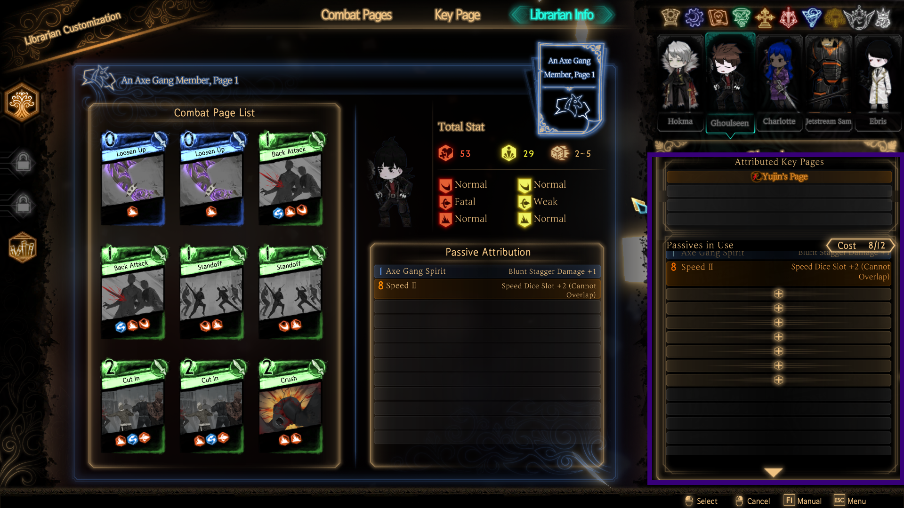

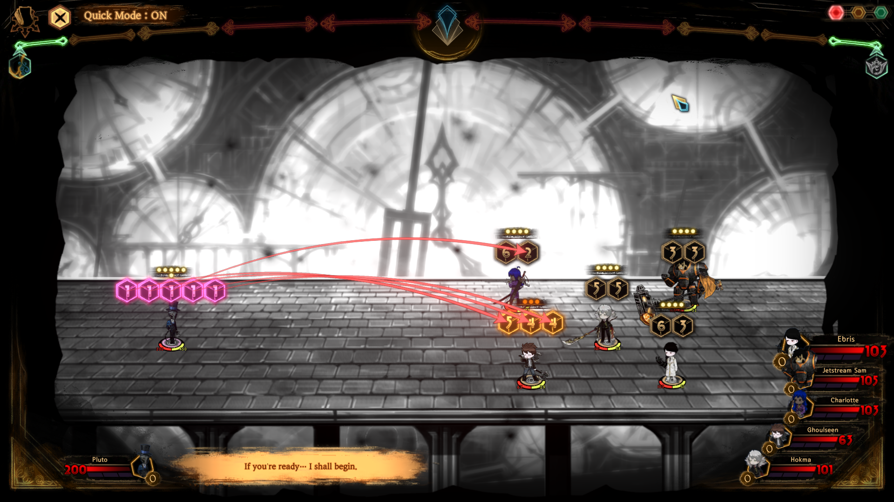

I suggest you leave Swiftness un-redirected because that one mostly doesn't do anything, but you're free to run other contract(s) that you want to keep for whatever reason.

Because the Shades copy the keypage of your assistant librarians, the fight quickly reduces to a mostly-typical 4 vs 4 fight.

### Strategy 3: Blockma

Through the power of Combat Preparation and Bi An (mostly Combat Preparation), the Shades' decks become mostly non threatening, while your librarians' decks still pack a punch. Blockma abuses Shades' battle behavior: they alternate between two different "modes". First, they play a card from the copied librarians' deck alongside "Shadow Image". On the next turn, they either play two copies of the page that beat the Clash Lose die effect, or two copies of "I'M THE REAL ONE\!\!\!" (a 9-9 9-9 9-9 offensive page) if the Clash Lose effect was not activated.

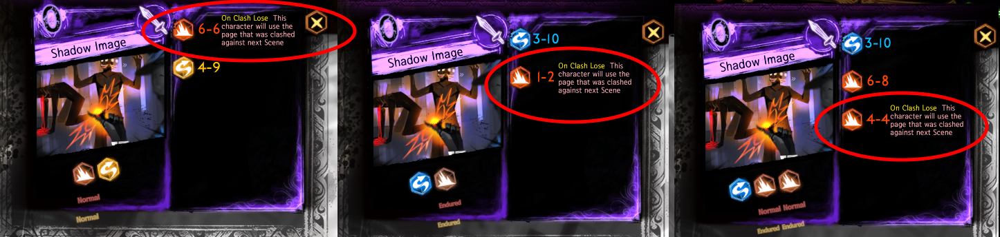
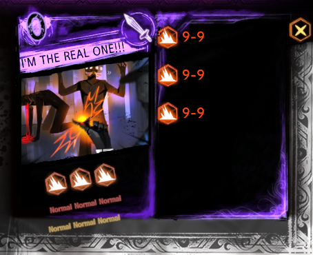

By stacking irresponsible amounts of Endurance on all your librarians using Combat Preparation, you can slowly stagger the Shades while being untouchable. Aim to play at least 2 Combat Preparations across all librarians every turn (ideally 3 or more). Try to prevent the Shades from copying Combat Preparation also.

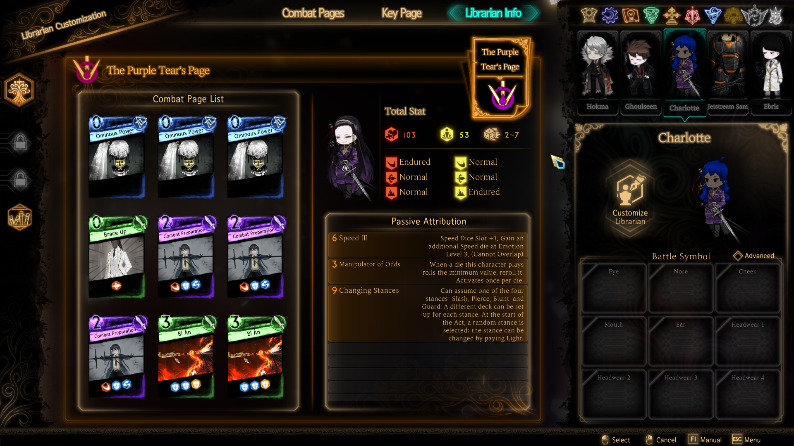
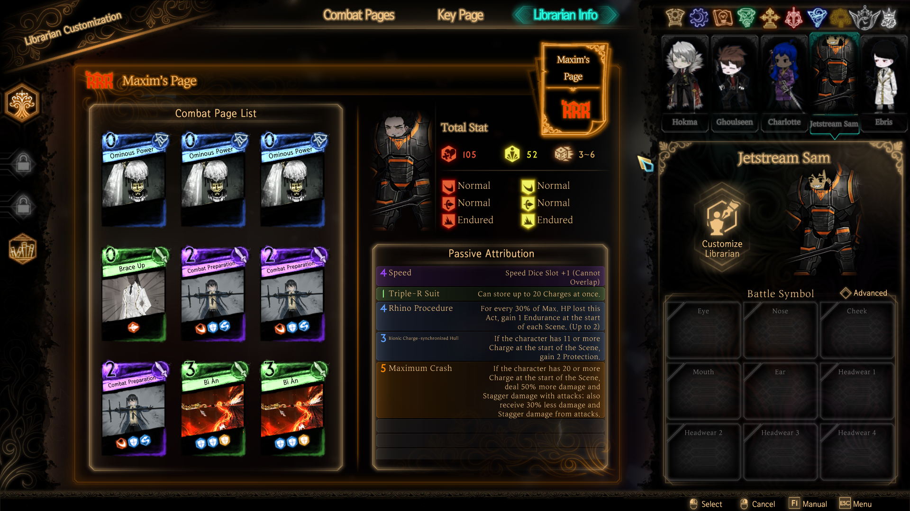
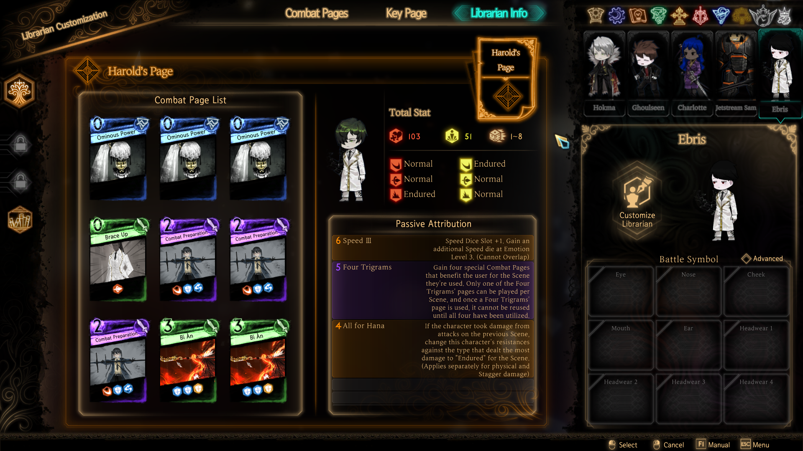

(note: no attributions)

Although Combat Preparation practically guarantees that you win every clash, I do not recommend going *full* Blockma. Instead, leave one or two non-Blockma decks so that you have a nugget that can finish off Shades who get staggered from all the blocking. Ironically, the best non-Blockma holder is Hokma himself as Shades do not copy his deck.

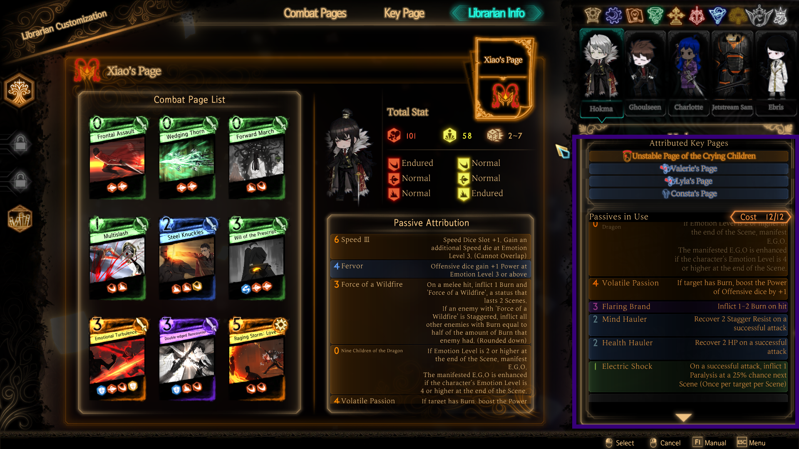
(Aside: since Shade-exclusive pages are mono-blunt, attributing Stiletto on your assistant librarians will make clashing with Shadow Image and I'M THE REAL ONE\!\!\! easier. Keep in mind that this will also boosts the Shades' pierce dice)

#### Recommended Abnos \+ Egos: 

* Abnos:
  * Tier 1: Lean Bloody Wings = Attention and Focus \> Gaze of Others \= Baptism \> Thirteenth Toll \> Time
  * Tier 2: Confession (time this well) \> A Nostalgic Sound \= Advent (do not put on Light contract) \> Penance \> Martyr \= Silence
  * Tier 3: Divine Power \= Apostles \> Sentinel
* Egos: Sound of a Star \> Penitence \> Dead Silence \= Heaven \>\>\> Paradise Lost

#### Demo

{{ youtube(id="GyUGJ6FHGfI") }}

### Strategy 4: Whatever Po Po is doing

Here, just...copy whatever Po Po is doing (he takes Swiftness and Amplification – build in English at end of video)

{{ youtube(id="\_iAh8D0mebs") }}

# Keter

Reference: [Keter, spoiler free builds](/articles/ensemble-spoiler-free/#keter)

He has Lone Fixer, but so do you (unless you forgot to attribute). He also has some mechanics with Vibration...but with the exception of clashing vs Resonate, you can ignore Vibration for the most part.

## Gameplay Tips

* Look to clash Crystal Atelier's counter die against triple- or quadruple-offense pages
* Hitting Durandal will let you win most of your clashes in the next scene, but making Durandal land is tricky. 1-side and/or time Durandal with your The Black Silence passive to maximize these odds. You should look to land Durandal whenever possible.
* Clash Wheels Industry or Mook Workshop against Unhinged Melodia to prevent the \+3 strength gain, which will make your life immensely difficult next scene if it activates
* Unless you managed to land both dice on Durandal on the previous scene, prefer 1-siding with your 0-costs over clashing
* Towards the end of the fight, Argalia should be low enough on stagger that you can rush him down. Sword of Frost facilitates this as all of your pages will fire before any of his.
* Save Furioso the very end when Argalia hits his 25 HP health gate.

### Recommended Abnos \+ Egos: 

* Abnos:
  * Tier 1: Pulsation  \= Pale Hands \= Lies \= Scars \> Curiosity \= Urging. The ranking of tier 1 abnos are highly opinionated as your playstyle will dictate which abnos you prefer.
  * Tier 2: Sword of Frost \> Learn \> Blood \> Fervent Beats. Fervent Beats is funny, but there's a high probability that you'll just blow yourself up instead.
  * Tier 3: Blizzard, for the bind. Argalia is immune to immobilization.
* Egos: You don't have any.

### Demo

{{ youtube(id="03pn6mFFbic") }}

# Black Silence

You have to feel the same sorrow as mine...

Bring your [Elite Squad](/articles/ensemble-spoiler-free/#the-elite-squad) to deal with this mess. You can go back to the deckbuilding screen by quitting to title and re-entering the game.

## Phase 1 \- Roland

5v1 fight where Roland is kinda normal. He cycles like so:

1. x1 Atelier Logic, x1 Durandal, others
2. x1 Wheels Industry, x1 Durandal, others
3. x1 Crystal Atelier, x1 Mook Workshop, x1 Durandal, x1 Atelier Logic, others
4. x1 Furioso, x2 Durandals, others
5. Repeat

"Others" here referring to some combination of Alias Workshop, Old Boys Workshop, Ranga Workshop, and Zelkova Workshop

### Tips:

* **Do not let Roland land Durandal.** If there's only one takeaway you can get from this phase, it's this.
* Wheels Industry \+ Mook Workshop: clash with leading block, e.g. Absorb Impact, Double-edged Rencounter, Graze the Grass. If you brought Binah, Pillar can delete the strong first die.
* Alias Workshop \+ Crystal Atelier: either incredibly powerful clasher (True Trigram Formation, Double-edged Rencounter) or just don't bother and let it 1-side
* Atelier Logic: clash vs using big single dice OR with powerful clasher
* Furioso: You should stagger or kill Roland before he uses this page. If he does land it, just hope it doesn't result in loss of life. Pillar can delete this page.
* Others: should be free wins to clash vs unless you let Durandal through

## Phase 2 \- Smoke Monster

Big Roland spawns 4 minions. Each time one of his minions die, Roland loses 50 HP and respawns the minion. This continues until Roland goes down to 300 HP or below, which will deactivate this effect.

If you stay on this phase for too long, eventually he'll start throwing out mass attacks.

### Tips:

* This phase is generally regarded as the least threatening. Use this phase as an opportunity to build hand size, light, and team emotion. You should be able to end every scene at full light and full hand size.
* Use the bare minimum to deal with the minions each scene, and throw everything else at Roland's main body

## Phase 3 \- Angelica

There are two mechanics you need to pay attention to: Soul Link and Combo.

### Soul Link
Both Roland and Angelica start with 4 stacks of Soul Link; they're practically invincible while Soul Link is up. In order to deplete Soul Link:

* Win the clash against Angelica's Unstable Bond with the "Dark Presence" buff
* Win the clash against Roland's Unstable Bond with the "Ashen Presence" buff

In order to obtain these buffs:

* Obtain the "Ashen Presence" buff by redirecting Angelica's "Ashen Bond"
* Obtain the "Dark Presence" buff by redirecting Roland's "Dark Bond"

Thus, you can deplete up to two stacks of Soul Link per turn.

### Combo
If Angelica and Roland target the same librarian with the same workshop page, then Roland will give his dice to Angelica. For example, if Angelica's Zelkova Workshop (4-8 slash, 3-8 blunt) and Roland's Combo: Zelkova Workshop (3-8 slash, 3-8 slash) both target the same librarian, then Roland will not play Zelkova Workshop, but Angelica's Zelkova Workshop will attack the librarian with a 4-8 slash, 3-8 blunt, 3-8 slash, 3-8 slash in that order.

Therefore, there are three main strategies to deal with this:

1. Split focus: multiple librarians clash into these cards to prevent one from getting overwhelmed
2. Counter with a single strong 3-cost clasher. The threat from Combo pages come from obscurity: your librarian has to defend against more dice than the pre-combat screen will lead you to believe. But even with dice getting shuffled around, most combo pages are 3- or 4-dice attacks.
3. Ram a combo page into a counter die that you know will win every clash.

Prioritize depleting Soul Link over breaking up Combo.

## Phase 4.1 \- Memories

Roland uses a bunch of cards. He spawns several weapons behind him over 3 turns. At the end of the third turn, he uses a powerful mass. He will move to Phase 4.2 if he hits 400 HP.

The strategy is to deal damage hard and fast enough to force a phase change before the mass attack happens. Ignore the weapons he spawns behind him as that will prevent dealing damage against Roland himself.

**Do not sacrifice econ in order to deal damage.** While Roland is charging up his mass, his attacks are fairly weak. Use this opportunity to rebuild your econ (card draw and light restore) and prepare yourself for success in the next phase. Even though this segment is a DPS race, at this point, your librarians should be at high emotion level. Even by using mostly econ cards, you should still be able to kill him.

## Phase 4.2 \- Abno Clones

Roland goes to sleep and spawns clones. In 3 turns, he will wake up, use a powerful mass, and move to Phase 4.3. If the clones are still alive at this point, they will follow him to Phase 4.3.

The strategy is to kill the clones:

* Fervent Beats (left top): 1-side to death
* Aspiration (right top): 1-side to death
* Learn (left bottom): Clash with econ cards, then 1-side to death
* Pulsation (right bottom): clash with strong clasher, then 1-side to death

There is no priority as each clone is fairly frail. Try to spread out your damage for maximum efficiency.

## Phase 4.3 \- Finale

Roland throws out attacks until he dies for real this time. So just kill him.

For the mass – if you have less than \+6 power on yourself and/or don't have a strong first-die page, accept that you'll get hit.

### Demo

{{ youtube(id="HLPOR0zEckk") }}

# Keter Realization

Bring the [Elite Squad](/articles/ensemble-spoiler-free/#the-elite-squad). Make sure you quit to title so that you are able to deckbuild properly.

Note that during the entirety of this realization, you gain twice as many emotion coins. 

## Phase 1.1 \- Wrist Cutter

Objective: survive.

On turn 3, Wrist Cutter will use many threatening pages. In order to counter this, you want to use x2 Display of Affection. You need 6 light to do this, which means you should spend the first 2 turns building emotion level:

* Turn 1: Clash with Lean, Bloody Wings (just one)
* Turn 2: Clash Profound Sorrow with Coffin,
* Turn 3: x2 Display of Affection

So long you manage to not die by the end of turn 3, you'll move to phase 1.2.

**Abnos**: 

* Tier 1: Urging \> Scars \> Pale Hands \> Pulsation \> Lies \= Curiosity
* Tier 2: Sword of Frost \> Learning \> Blood \>\>\> don't pick Fervent Beats
* Tier 3: Situational; Blizzard if you need to immobilize right now, A Kiss otherwise.

## Phase 1.2 \- The Cavalry's Here

The rest of the team spawns in. 

On the first turn, Wrist Cutter uses some powernull pages that inflict "Depression." If both attacks connect, your librarian will likely be staggered in the next scene. At the very minimum, clash against a strong first die page to prevent instastagger.

On the second turn, Wrist Cutter uses various triple offense pages. Try to clash versus these with assistant librarians.

On the third turn, Wrist Cutter uses a 25-25 mass alongside a bunch of counter dice targeting Angela. Redirect ALL the counter dice away from Angela; otherwise she'll take a lot of damage and likely die. With Angela, play Display of Affection against Wrist Cutter's mass (taking care not to redirect counter dice) followed by Lean Bloody Wings, which will deal a lot of damage to Wrist Cutter.

This 3-turn cycle repeats until either Wrist Cutter or Angela dies.

If you're having trouble keeping Angela alive, bring Mirinae with the following changes: cut Fervor and Remain Vigilant in Peace on Mirinae and then replace them with Puppet Strings and Nuovo Fabric. When Mirinae spawns, use Puppet Strings on Angela.

### Demo

{{ youtube(id="L2sfkcDegnk") }}

## Phase 2 \- Aspiration

Aspiration has four hearts, whose effects are randomly ordered and explained in their status:

* The Wait: give 3 Hankering to Aspiration at the end of the scene
* The Pain: give 4 Hankering to Aspiration when another heart dies
* The Effort: give 1 Hankering to Aspiration on hit. If no Hankering was given this scene, subtract 2 Hankering from Aspiration
* The Faith: gain strength and endurance equal to half of Aspiration's current Hankering count (rounded up)

These effects are centered around gaining "Hankering", which has the following effect:

 > While this character is on the offensive, **gain Strength equal to the amount of this status**. The amount of Hankering is reset when this character is Staggered or when the Scene in which Aspiration goes on the offensive ends.

In other words: every four turns, Aspiration launches a mass attack whose power is `(15 + Hankering count)`, and she fires other attacks that likewise scale off Hankering count. At low Hankering, this is very easy to beat; at high Hankering count, this will instantly wipe your entire team. Therefore, aim to keep Hankering as low as possible at all times, preferably 10 or lower.

Note that, due to The Wait's and The Pain's effects, preventing Hankering gain is **impossible**. You can try to rush down both of these hearts, but you will inevitably let at least 6 or so Hankering through. Since gain prevention is impossible, the strategy is to focus on **forcing Hankering loss** through The Faith's and The Effort's special loss effects.

To reduce Hankering, either win every clash against The Effort, or win every clash against the page "Inclination" from The Faith. Some tips to consistently bleed her out (pun intended):

* Double-Edged Rencounter (especially on Olivier), Angela's Display of Affection, and Angela's Regret are good at winning versus The Effort's powernull pages
  * Display of Affection has a \~68% chance of success (not "Display of Affection minroll vs Turbulent Beats maxroll" on first die \= 11/12, don't lose last die \= 3/4)
  * Double Edged Rencounter on Olivier is a guaranteed clash draw at minimum
* 3 Paralysis can turn Turbulent Beats's 5-8 5-8 4-7 into a 5-5 5-5 4-4, which is much easier to clash against. Attribute Electric Shock onto nuggets that are hitting The Effort
* You can use mass summations (such as Fourth Match Flame in Angela's Ego hand) to remove one of The Effort's powernull page
* You do *not* want to use a mass summation to destroy Inclination as this will also prevent its Hankering loss effect. Only do this if you know that, for whatever reason, you cannot win clashes against that page

Due to the Hankering loss strategy, prioritize Pain \> Wait \> Faith \= Effort.

Aspiration's mass will instantly heal all hearts. Despite this, on her mass scene, prefer to burst down a living heart over targeting Aspiration, which will set you up nicely for the second cycle.

\~\~

During Aspiration's non-offense turns, she will use a large amount of 20-20 counter block dice. Usually, this is not possible to break through, and you will stagger yourself if you try. However, by using the abno page "Learn" or by using Nikolai's Disposal, you can destroy every counter die with that one page, opening Aspiration up for some serious damage.

If you want to use this cheese, disregard the recommendation to burst down a heart over targeting Aspiration. Instead, now use the first cycle to punch some damage into Aspiration, and then Learn or Disposal on the next turn to finish her off.

**Abnos**: 

* Tier 1: Urging \> Scars \> Pale Hands \> Pulsation \> Lies \= Curiosity
* Tier 2: Sword of Frost \> Learning \> Blood \>\>\> don't pick Fervent Beats
* Tier 3: Situational; Blizzard if you need to immobilize right now, A Kiss otherwise.

### Demo

{{ youtube(id="qHJ5IYv8nUE") }}

## Phase 3 \- Pinocchio

Marionette has four puppets, each with their own effect:

* A Song for All \- all puppets (including Marionette) gain 2 strength or 2 endurance each turn
* A Song in Backwards \- all puppets (including Marionette) copy librarian status effects
* A Song of Curiosity \- Librarians no longer follow standard card draw rules. Instead, each turn they get 4 cards in hand instead (3 from effect \+ 1 from natural draw). This is the same effect as the abno page "Curiosity"
* A Song of Lies \- Librarian combat pages which cost 3 or less are now randomized. This is the same effect as the abno page "Lies"

Additionally, each puppet copies the deck of one of your librarians.

Every three turns, Marionette uses a Lie – this is a card with wrong dice. In the same scene, Angela and a random assistant librarian will obtain the page Lying is Bad\!, which isn't actually explained but here goes:

* If you clash Lying is Bad\! against the lie, all puppets (including Marionette) will get 4 feeble and 4 disarm on the next scene
* If you *don't* clash Lying is Bad\! against the lie, all puppets (including Marionette) will get 4 strength and 4 endurance on the next scene instead

The strategy is to kill the puppets from most to least threatening: All \> Backwards \> Lies \> Curiosity. Masses, such as Angela's Fearlessness to Keep On Living (in Ego hand) are situationally helpful also.

Occasionally Marionette uses Eliminate Error against one of the puppets and instakills them. Ignore this; she's helping you. Additionally, you can provoke her into playing this card by bringing a puppet to half of its HP or less.

**Abnos**: 

* Tier 1: Urging \> Scars \> Pale Hands \> Pulsation \> Lies \= Curiosity
* Tier 2: Sword of Frost \> Learning \> Blood \>\>\> don't pick Fervent Beats
* Tier 3: Situational; Blizzard if you need to immobilize right now, A Kiss otherwise.

### Demo

{{ youtube(id="HkEfFXMQaWQ") }}

## Phase 4 \- Snow Queen

Similarly to the Snow Queen suppression, you need to free all your librarians. Afterwards, Angela throws out a bunch of attacks.

Thankfully, you can free your librarians easily due to the plethora of masses in Angela's Ego hand. The gist of it is that you want to use Courage to Protect or Expectation for the Meaning of Existence in order to deal damage as well as get that juicy \+5 strength buff, followed by using blunt masses such as Fearlessness to Keep On Living to free the librarians. Use Shyness and Token of Friendship to simultaneously push emotion level, protect yourself, and restore light.

Here's a sample cycle, though depending on the cards you draw, you may need to deviate from this. Feel free to play around and figure out your own Ego spam strategy (a lot works):

* Turn 1: Shyness \+ Coffin
* Turn 2: Courage to Protect \+ Shyness
* Turn 3: Expectation for the Meaning of Existence \+ Shyness
* Turn 3: Fearlessness to Keep On Living \+ Shyness \+ Token of Friendship
* Turn 4: Those who are Faithful and Trustworthy \+ Shyness \+ Token of Friendship
* Turn 5: Courage to Protect \+ Shyness \+ Shyness \+ Hope to Become a Better Person

Once your librarians are free, Snow Queen will throw out a mass attack (you will almost certainly fail defending against this) followed by a somewhat uneventful beatdown afterwards. You want to stabilize in terms of emotion level and econ as soon as possible, which will make handling the beatdown easier. You should also use this opportunity to use as many unused Ego pages in Angela's Ego hand as possible.

**Abnos**: 

* Tier 1: Urging \> Scars \> Pale Hands \> Pulsation \> Lies \= Curiosity
* Tier 2: Sword of Frost \> Learning \> Blood \>\>\> don't pick Fervent Beats
* Tier 3: Situational; Blizzard if you need to immobilize right now, A Kiss otherwise.

### Demo

{{ youtube(id="gPvzvKwYv88") }}

## Phase 5.1 \- Silent Girl

Remorse spawns four hands that will beat you down.

Hands play combat pages that have either a cost-up or a cost-down mechanic: the goal is to get the nail hands to lower their costs by hitting them with higher cost pages (so they gain less power), and to get the hammer hands to raise their costs by hitting them so they brick. Note to yourself that the front hands will likely gain \+3 power due to their Guilt passive. Beyond that, you can ignore this mechanic.

Hammer and nail hands also inflict a status that occasionally does a lot of damage. You can ignore this mechanic also.

The back hands occasionally play one of two pages: Splitting Heart, which gains power equal to the user's remaining light, and Collapsing Heart, which is reused for every point of remaining light. For Splitting Heart, respond with a leading block to mitigate damage. For Collapsing Heart, destroy this page with mass attack.

It is highly recommended that you use each of Angela's Ego pages at least once by the time this phase ends.

This phase ends when all hands die. Prioritize killing the front hands first, then the back hands, one at a time.

**Abnos**: 

* Tier 1: Urging \> Scars \> Pulsation \> Pale Hands \> Lies \= Curiosity
* Tier 2: Sword of Frost \> Learning \> Blood \>\>\> don't pick Fervent Beats
* Tier 3: Situational; Blizzard if you need to immobilize right now, A Kiss otherwise.

## Phase 5.2 \- Remorse

Remorse spawns four more hands…and joins the fight herself.

* Back hands will play block counters for three consecutive turns before going "on the offensive". Hitting the back hands will reset the timer back to 3\. The game does not tell you this.
* Front hands will play various attacks. However, if they get hit, on the next turn they will gain a whopping \+10 power\! You will lose every clash, even with Myongest.
* Remorse plays cards that inflict the target with a double-sided powernull debuff. You can use this debuff to safely clash against the front hands, even when they have \+10 power.

The strategy is to focus down the hands one by one, using the powernull to stay safe against the \+10 power buff. You should also use a mass on occasion to reset the back hands' timers. Once you've cleared out all the hands, you can safely beat down Remorse.

This part of the fight is also a DPS check. You should have enough damage to kill all the hands, and then Remorse, within 9 turns, even with Guilt's effect. You may play Guilt in the event that you somehow did not kill Remorse within the 9 turns, but ideally you should avoid entering this situation in the first place.

You can use Purple Tear's stance change in order to remove the "Guilt" card from her hand and deck. You can even switch back to your original stance, and it'll just be gone. As stated before, however, you should aim to win the fight within 9 turns, so this trick is usually inconsequential.

### Demo

{{ youtube(id="J--q1QLJxSA") }}

# DEnsemble

They're back, so we have to beat them up again. Once again, you can clear this using the [Elite Squad](/articles/ensemble-spoiler-free/#the-elite-squad).

## Act 1

In this act, killing a member of the Ensemble will either grant your team buffs, or debuff the enemy team.

The four goons of Assiah are here:

* Philip: the offensive powerhouse of the group. He can deal a lot of damage from his triple-offense pages, and he can cause immobilization if he lands three stacks of "Restrain" on a single target. Every 3 turns, he uses a 14-20 mass summation that inflicts 10 burn on hit. When he's alive, all Ensemble attacks inflict 1 burn on hit. When he dies, the other Ensemble members permanently receive 1 burn on hit.
* Eileen: she's there to punish smoke decks. Additionally, every 5 turns, she uses a 16-22 mass summation that immobilizes on hit. While she's alive, all other Ensemble members gain "Puffy Brume," turning smoke from a debuff into a buff. When she dies, not only does she remove "Puffy Brume" from Ensemble members, but she also inflicts 10 stacks of smoke on everyone. 
* Greta: the tank. While she's alive, all Ensemble members gain 1 protection and stagger protection. When she dies, all Ensemble members are inflicted with 5 fragile for one scene.
* Bremen: the buffer. While they're alive, a random ally gains a random positive buff. When they die, all librarians gain 3 strength and 3 endurance for 1 turn.

Priority: Bremen \> Philip \> Eileen \> Greta.

Both masses are weak enough for you to roll against each time using strong mass busters like Duel, Double-Edged Rencounter, and Sturdy Defense. As a result, the masses end up reducing the overall damage of the enemies. Bremen's buffs on death should swing the battle in your favor.

Greta's Tackle Mount seems terrifying, but unless you're low on stagger, it's surprisingly ignorable. Your key pages should be able to shrug off its damage easily with Health Hauler and Mind Hauler. If you really want to win against this page, however, use strong first-die pages such as Duel or Deep Drag.

The first act is tougher than the others; don't be afraid to reset if you lose a librarian.

## Act 2

The three stooges of Briah are here:

* Oswald: On turn 1, Oswald plays a mass individual with a 6-10 blunt die. He then spawns in Mr. Knife and Ms. Mermaid. While Oswald is alive, all librarians take 2-4 stagger damage at the end of every turn. When he dies, all librarians fully restore stagger. (nothing else happens if Mr. Knife or Ms. Mermaid die)
* Tanya: On turn 2, Tanya plays a nerfed version of Beatdown that only hits one target. This version rolls 29-35. While Tanya is alive, all librarians take 3-5 damage at the end of every turn. When she dies, all librarians deal 3 extra damage on hit. If she is alone, she gains 2 speed dice and 1 strength.
* Jae Heon: On turn 1, Jae Heon plays Conjoining Strings, which grants two of your librarians the Red Strings status effect and the Red Strings combat page. While Jae Heon is alive, the Ensemble members reroll dice if they roll minimum value. When he dies, all librarians gain 1-3 haste and \+1 universal dice power.

Priority: Jae Heon \> Oswald and his minions \> Tanya.

Use mass attacks to clear Oswald's minions. Make sure the mass doesn't hit the 10-10 block page (reroll the mass targeting if it does). There's nothing you can do about Oswald's hiding mechanic, but he doesn't really do anything beyond being annoying. Haulers shrug off the chip damage from his passive easily. When Oswald unhides, he uses an 18-20 mass summation attack. Any clashbuster can win against this: Duel, Sturdy Defense, Double Edged Rencounter, etc. all work.

Tanya is a weaker version of herself from Ensemble. Haulers shrug off the chip damage from her damage passive. If she's alone, she gains 1 strength (regular Ensemble version gives herself 2 strength) and 2 extra speed dice (she wasn't using all of her speed dice in the first place). Despite ranking her as the least threatening, you should still aim to win clashes against her pages to mitigate damage. 

Jae Heon is dangerous due to his "Red Strings" effect, which contains an **instant kill** mechanic: if at least 2 participants, librarian or enemy, have this status by the end of the turn, all of them are instantly killed, and Oswald spawns Mx. Bunny.

In order to get rid of the Red Strings status, you need to get rid of the Red Strings combat page in your hand. This card is a 3-cost 28-28 block die with special text: it does not leave your hand unless you lose a clash with this card.

Thankfully, Tanya uses Beatdown every turn beyond the first: a 29-35 blunt die that conveniently outrolls the 28-28 block. You should clash Red Strings against Beatdown every turn you can in order to get rid of Red Strings. Additionally, in the event that you cannot get rid of Red Strings by the next turn, clash against the 10-10 block on Oswald's minions to prevent the instant kill effect from activating.

## Act 3

The two idiots of Atziluth are here (and Argalia):

* Elena: She has her own version of Health Hauler, occasionally plays a powernull anti-heal page (6-9), and occasionally plays masses
* Pluto: Spawns a clone of one of your librarians as a Shade, and periodically hands out nerfed versions of the contracts to your librarians.
* Argalia: Unstaggerable. Has a health gate at 100 HP until both Elena and Pluto are dead. Buffs all of his allies every 4 scenes. Gains an extra speed die when his allies die. Occasionally plays a threatening 30-40 mass summation

Priority: Pluto \> Argalia when he's above 100 HP \> Elena \> Argalia again

This fight can be threatening due to the plethora of masses that each Ensemble member throws out, resulting in unavoidable damage that may snowball out of control if you've taken too much stagger damage prior.

If you're scared of Elena's anti-recovery, strong first die pages and mass summations can break the 6-9 easily. On turn 4 or so, Elena throws out a 6-9 8-19 mass individual. You cannot beat that second die; just accept that you'll take the damage. Elena is non threatening otherwise, and it is useful to keep her alive to prevent buffing Argalia.

Pluto attempts to give out a contract every scene. All of his contracts damage your draw economy in some way:

* Unjust Counterpart: Defense: discards a random page and gain Protection equal to its Cost next Scene. Spend 1 light to use this page and get rid of this effect.
* Unjust Offense: Defense: prevents natural draw; boosts damage by 1\. Spend 1 light to use this page and get rid of this effect.
* Unjust Counterpart: Light: restore 1 additional light and add a useless card to your deck at the end of each scene. Spend 1 light to use this page and get rid of this effect.

Generally speaking, you want to get rid of your contracts as soon as you get them.

Pluto also spawns a Shade that clones your Patron Librarian. The shade dies if Pluto dies, so prefer dumping damage on Pluto's head instead of the Shade's.

Occasionally, Pluto throws out a 5-8 5-8 4-7 mass individual. Most 3-cost clashers can win against this card with some power investment.

On turn 2, Argalia uses a 6-9 mass individual. When both Pluto and Elena die, Argalia uses a 30-40 mass summation. The mass individual isn't a big deal, but the summation is very threatening; even the best mass busters can't consistently win against this roll without significant power buffs. To mitigate the effects of this mass summation, kill Elena as late as possible (when Argalia is at his 100 HP health gate) so that you can hopefully rush him down the next turn for the finish.

### Demo

{{ youtube(id="CL1Or6awmJs") }}

# The Head

This is a scripted fight: Barel and Zena play the exact same cards every turn, every time you play this fight (with perhaps different targeting). Here are some general gameplay tips to help you through the fight. If you manage to get through without anyone "dying," you get an achievement also.

## Gameplay Tips

* Turn 1: you aren't winning that clash against Serum W. If you have it, use Old Boys Workshop to mitigate some of the unavoidable damage you're gonna eat.
* For various reasons, if you use a ranged page (such as Atelier Logic **or even Pillar**) against Serum W or Serum R, you still take 30 damage and stagger damage. You skip the animation at least.
* Both Serum W and Serum R additionally have the hidden property that they occupy a priority class between normal melee pages and ranged pages. In other words, Serum pages will always play after all other ranged pages but before all other melee pages. As a result, you can't use Great Split Vertical's page deletion effect to delete Serum R.
* When possible, try to clash Binah or Roland vs Zena and Gebura vs Baral. Exceptions: Gebura can fight and win against any one clash per turn.
* Alas Workshop can reasonably clash against Baral's Trail if it also has the \+2 power boost from the Black Silence passive
* Try to keep Binah at high light level. Shockwave can come in clutch against particularly hard-hitting and unavoidable attacks
* Judiciously use Chain to mitigate damage (locks target out of using a speed die). On the other side of the coin, avoid Birdcage's speed die seal effect at all costs.
* Take advantage of Focus Spirit's leading block to defend against high first-die pages. Bonus points if the page in question is powernull. Extra bonus points if you manage to proc the on hit effect also.
* Pop Manifest Ego as soon as possible for Great Split Horizontal access. GSH can destroy a Serum and one of Zena's pages at the same time.

### Demo

{{ youtube(id="uLj3_PdvQM4") }}

# Credits

Special thanks to the following people who contributed to the making of this guide:

* Aisir
* Alice Margatroid
* Atse
* CountDuckoo
* Jakkie
* Mozzarella
* Render
* Stuff
* Loki

This is Loki.
